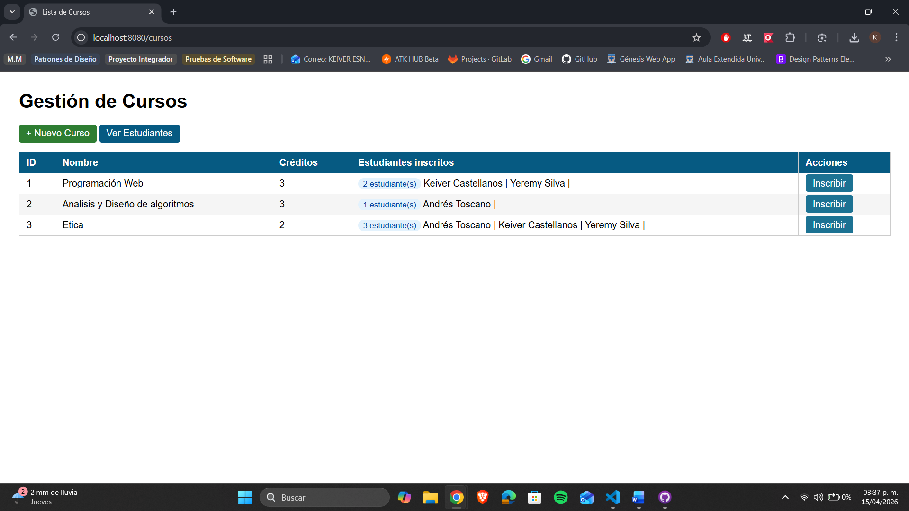
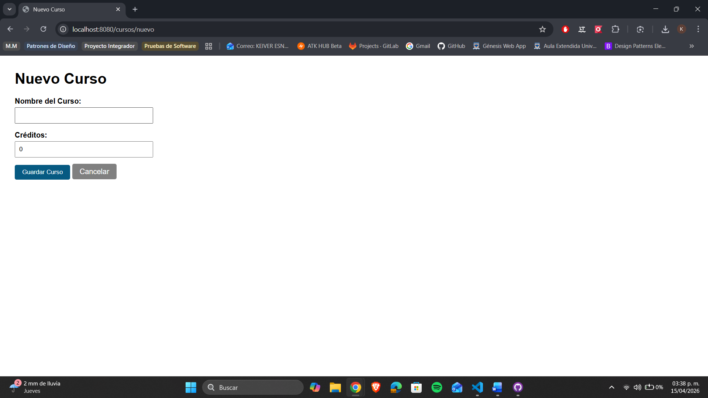
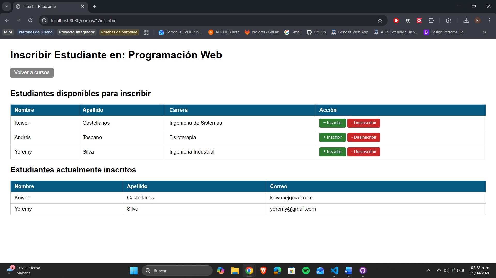
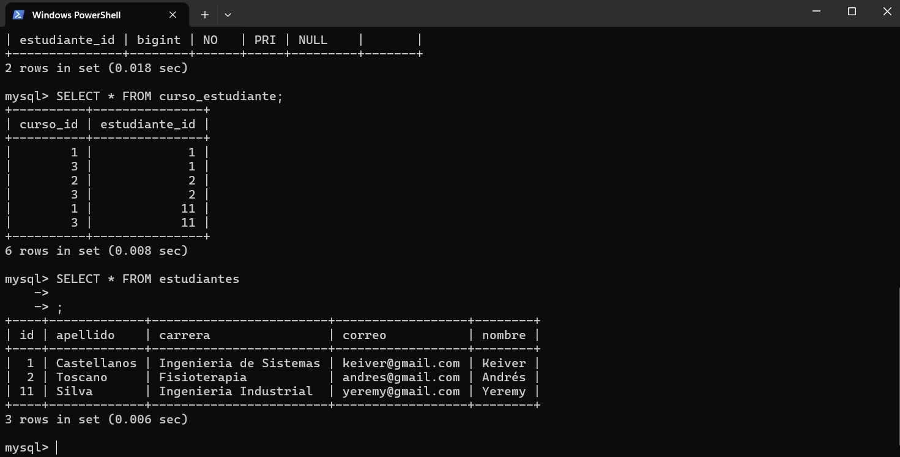
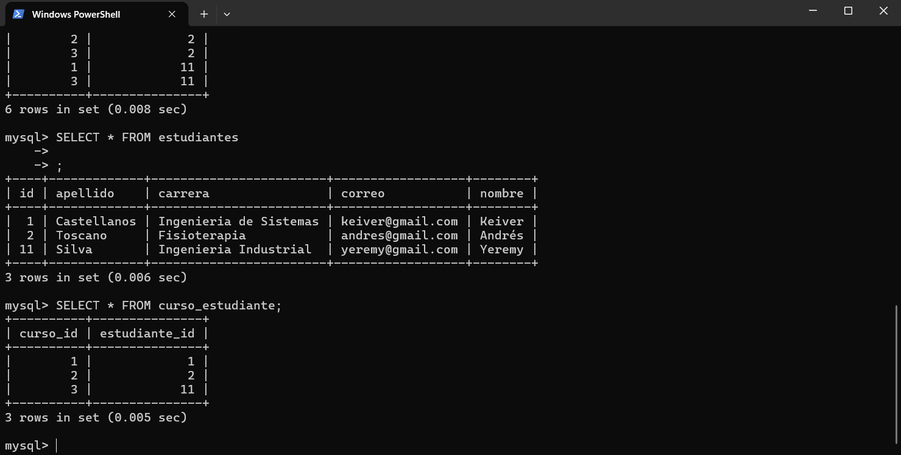

# Relacion @ManyToMany: Cursos y Estudiantes — Post-Contenido 2 Unidad 8

> **Post-Contenido 2 — Unidad 8**

Extension del proyecto del Post-Contenido 1 que implementa una relacion
@ManyToMany bidireccional entre las entidades Curso y Estudiante usando
Spring Data JPA. Hibernate genera automaticamente la tabla de union
curso_estudiante. Incluye JOIN FETCH para evitar el problema N+1.

## Diagrama ER

```
+-------------+       +-------------------+       +-------------+
|  estudiantes |       |  curso_estudiante  |       |    cursos   |
+-------------+       +-------------------+       +-------------+
| id (PK)     |<------| estudiante_id (FK)|       | id (PK)     |
| nombre      |       | curso_id (FK)     |------>| nombre      |
| apellido    |       +-------------------+       | creditos    |
| correo      |                                   +-------------+
| carrera     |
+-------------+
```

## Tecnologias utilizadas

- **Java 21**
- **Spring Boot 3.5.1**
- **Spring Data JPA / Hibernate**
- **MySQL 9.6**
- **Thymeleaf**
- **Bean Validation**
- **Maven 3.9.12**

## Configuracion de la base de datos

```sql
-- La base de datos ya existe del Post-Contenido 1
-- Hibernate crea automaticamente las tablas cursos y curso_estudiante
USE estudiantes_db;
SHOW TABLES; -- debe mostrar: estudiantes, cursos, curso_estudiante
```

## Instrucciones de ejecucion

1. Clonar el repositorio

```bash
git clone https://github.com/tu-usuario/castellanos-post2-u8.git
cd castellanos-post2-u8/estudiantes
```

2. Ejecutar la aplicacion

```bash
mvn spring-boot:run
```

3. Acceder a la aplicacion
   - Estudiantes: http://localhost:8080/estudiantes
   - Cursos: http://localhost:8080/cursos

## Funcionalidades implementadas

- **CRUD de Estudiantes:** heredado del Post-Contenido 1
- **CRUD de Cursos:** crear y listar cursos
- **Inscripcion:** agregar estudiantes a cursos
- **Desinscripcion:** quitar estudiantes de cursos
- **Relacion bidireccional:** helper methods sincronizan ambos lados
- **JOIN FETCH:** evita el problema N+1 en consultas de cursos
- **Tabla de union:** curso_estudiante generada automaticamente por Hibernate

## Capturas de pantalla

### Lista de cursos con estudiantes inscritos



### Formulario de nuevo curso



### Pantalla de inscripcion



### Tabla curso_estudiante en MySQL



### Lista despues de desinscribir


